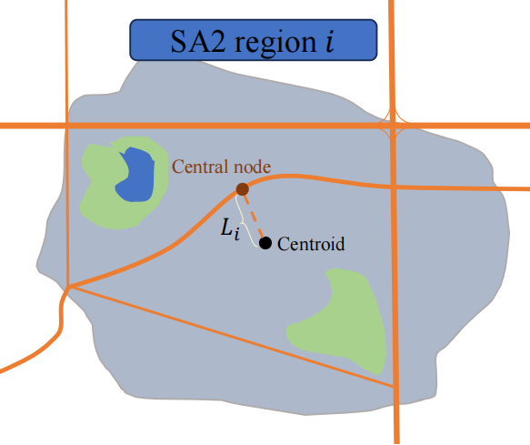
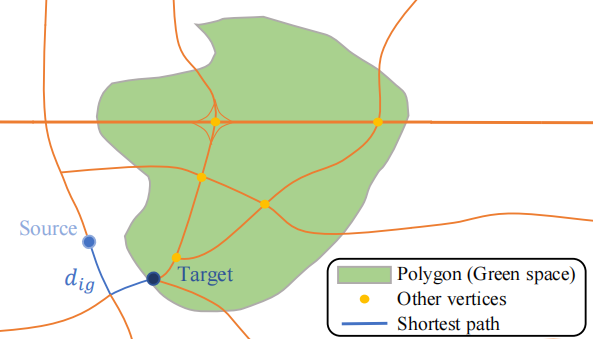
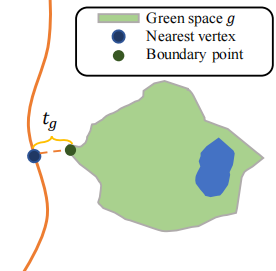
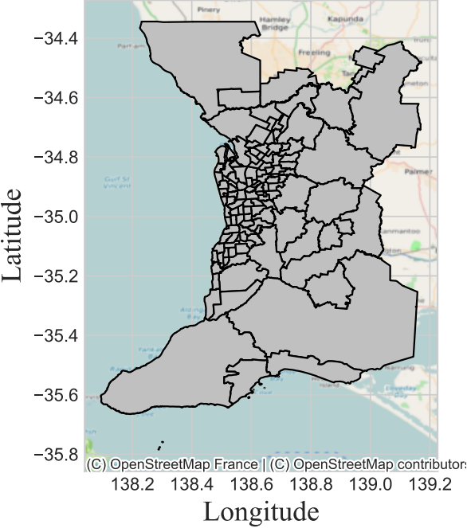
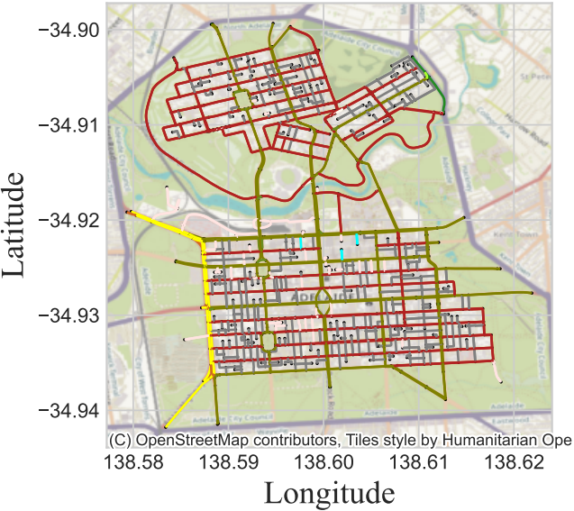
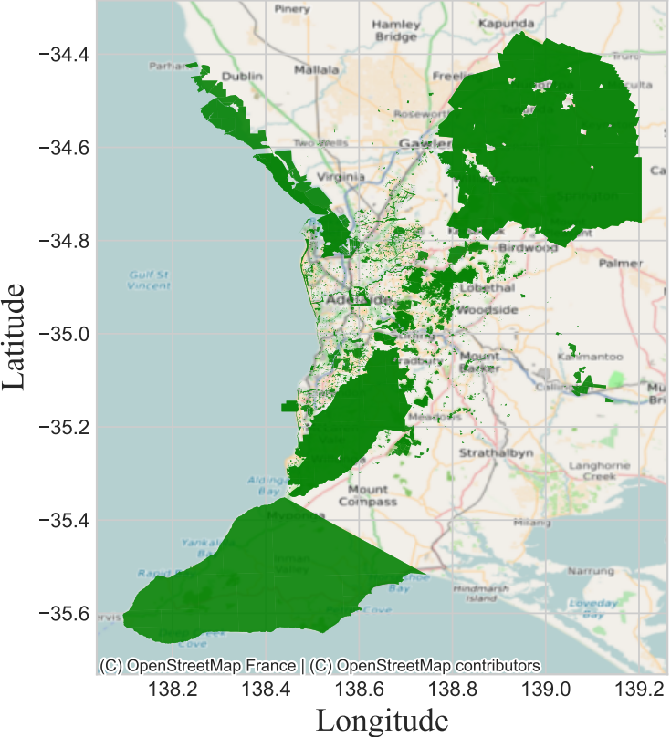
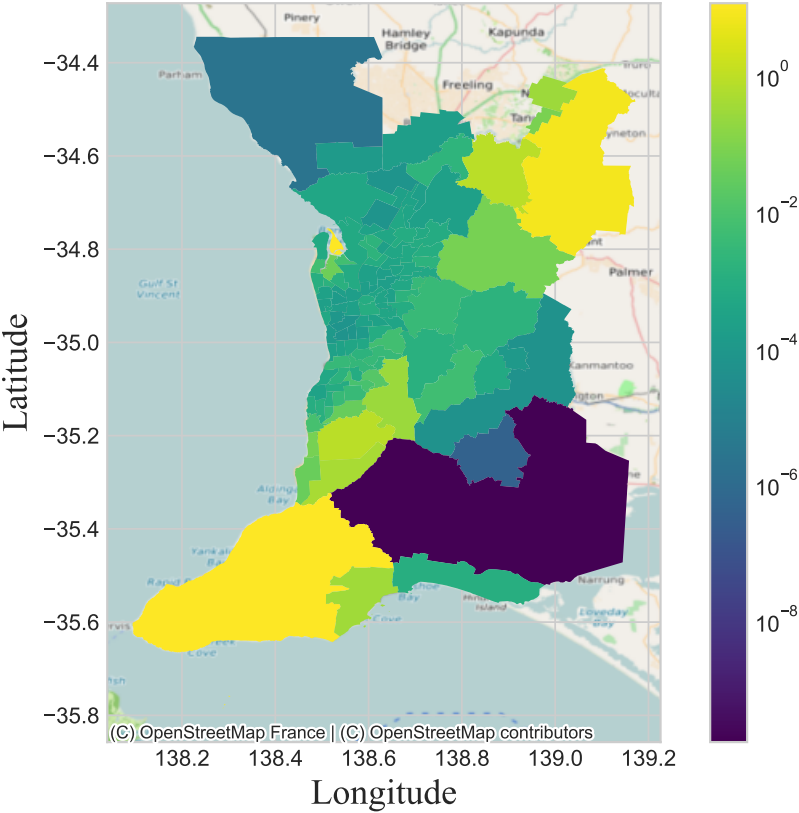
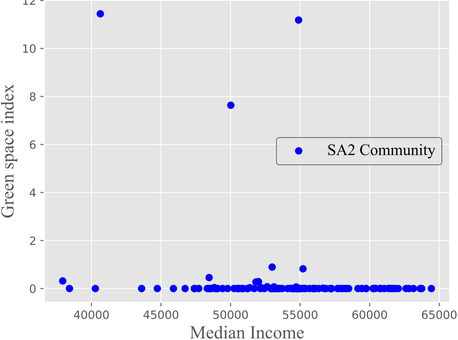
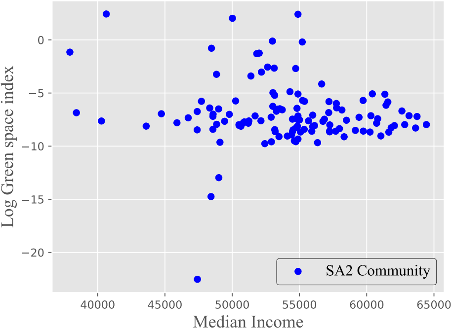
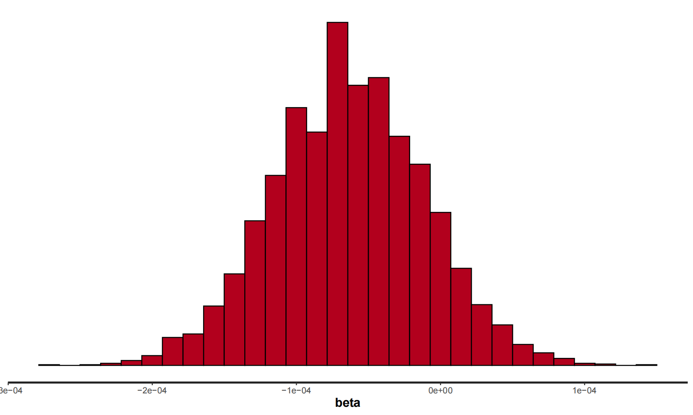

# 2024 Summer Research
##  Access to green space in Greater Adelaide

**Author : Jiaqi Yao, Jingyu Duan** 

**Supervisor : Prof. Lewis Mitchell ** 

**School of Computer and Mathematics Science, The University of Adelaide** 
-----------------------

## 1. Our Goal
No matter where we are, green spaces are universally regarded as places that bring people close to nature. It plays an essential role in helping people relax at work and enjoy high-quality family time [[1]](#1). In urban development, they are referred to as the ‘lungs of a city’ or ‘city’s air conditioner’ [[2]](#2).

As a consequence, residents tend to live in communities that are close to green space. This has become one consideration factor when choosing new homes. However, with the increase in population, the rapid development of cities has also brought forth numerous challenges. Regional disparities in city economic development are constantly widening. The same problem also happens in green space distribution.

So our motivation for the research is to investigate whether this inequality phenomenon is related to the economic income of residents. In other words, is green space inequality positively correlated with socioeconomic status?

To answer this question, we first split our goal into two parts:

1) How can we examine and visually represent the distribution of green spaces in Adelaide, as well as the proximity of homes to these green areas?

2) How access to green spaces is related to socio-economic status？

## 2. SA2 Community
But there's a tricky question at the moment: do we really want to measure access to green space on a household basis? If so, our data is quite extensive, requiring a substantial amount of computation. The samples lack statistical significance due to the presence of too much noise and uncertainty. And we don't have that kind of data. 

The Australian Bureau of Statistics, they have helped us address this issue. They have segmented Australia into numerous communities, which are called SA2 [[3]](#3). Using their words:” SA2s are medium-sized general-purpose areas representing community that interacts together socially and economically.” Therefore, we can measure the access to green spaces on a community basis.

## 3. Measure Access to Green Space
So far, our study subject is a set of many SA2 communities and a set of many green spaces. We need to find a method to connect those two sets and an indicator to quantitatively analyze the access to green space for each SA2. After comparison, we used the metric called green space index proposed by Farahnaz in his article to analyze green space in Melbourne [[4]](#4). For SA2 $i$, denote its Green Space Index $G_i$ by this formula.

$$
G_i = \sum_{g}\frac{A_g}{\exp(D_{ig}) \cdot C_g}
$$

 Where

* $D_{ig}$: Network distance between the centroid of SA2 $i$ and the boundary of green space $g$;
        
* $A_g$:  Area of green space $g$;

* $C_g$:  population density of the SA2 that green space $g$ belongs to.

For each community, this indicator sums up its ability to reach all green spaces. This is consistent with the fact that one public green space is not open to a special area. For access to one individual green space, the formula considers the positive impact of area on attractiveness, as well as the negative effects caused by distance and density. Distance is the most important, so we use an exponential function for weighing.

### 3.1 Network Distance

Let us take a look at the network distance first. Network distance refers to the length of travelling journey on the road, which indicates a difference from the geometry distance. How can we find them? In Data Science, road network is often viewed as weight directed graph. So our problem is the famous shortest path problem in graph theory. 

So the first problem we need to solve is that the geometry centroid of a SA2 is not a vertex in road network. To start our shortest path calculation, we need to find the nearest network vertex from the centroid. We call it central vertex of community. The distance between two points is denoted as $L_i$. 

    
     
    
Figure 1 : Distance L
    

\
Starting from the central vertex, we could use Dijkstra’s algorithm for all other vertices [[5]](#5). But here we are dealing with distance to a community polygon. Our method is to identify all network vertices located inside the polygon as one set. Again Dijkstra’s algorithm, we can find the distance to all the vertices in the set and search the minimum one.

As in Figure 2, all these vertices are located in this green space and we find that target vertex has the shortest path. This is also the distance between the central vertex of SA2 $i$ to the boundary of green space $g$ and denote it as $d_{ig}$. 

    
     
    
Figure 2 : Distance d
    

\
But when were actually doing this, we encountered a new problem. Some of the green spaces do not include any network vertex, which makes our method not work. In this case, we find the nearest vertex from the boundary of green space and denote it as $t_g$. If this is not the case, $t_g$ is set to be 0.

    
     
    
Figure 3: Distance t
    

\
In all, the network distance $D_{ig}$ is

$$
D_{ig} = L_{i} + d_{ig} + t_{g}.
$$

In matrix form,

$$
D_{ig}_{m\times n} = \boldsymbol{L}_{m\times 1}  \times \boldsymbol{1}_{1\times n} + [d_{ig}]_{m\times n} + \boldsymbol{1}_{m\times 1} \times  \boldsymbol{t}_{1\times n}
$$

### 3.2 Area and Density
In terms of area and density, they are easy to find as long as we get the dataset for SA2 and green space. We need their Geography and population information. (Actually not that easy :D, but too many details to say about it).

## 4. measure the Socioeconomic Status

So far, we have solved the first goal. So the next key issue is, how can we find an indicator to measure Socioeconomic status? At last, we choose the median personal income by geography and denote it as $M_i$ [[6]](#6). 

## 5. Relationship Between Income and Green Space Index
To analyze the relationship between the green space index and median income, we propose three different methods. 

### 5.1 Bayesian Linear Regression
The first one is the Bayesian linear regression model. We will mention more about it later.

### 5.2 LISA
The second one is Local indicators of spatial association, which is abbreviated as LISA. For each SA2, denote its local Moran’s I index by [[7]](#7)

$$
I_i = \hat{M_i} \cdot \sum_{j} [W_{ij} \hat{G_{j}}].
$$

Here $\hat{M}$ and $\hat{G}$ are both of standardized version of our data and $W$ is weight adjacency matrix.

The global Moran’s I index is the mean of local ones

$$
I = E[I_i].
$$

In bivariate testing, it is used to detect whether there is a significant spatial clusters of two variables. It is similar to correlation. But it takes into account the impact of regional distribution. And it performs quite well in geography analysis. Its value ranges from -1 to 1. In our analysis, if it is positive, high-income communities will have better green resources, indicating inequality.

### 5.3 Mann–Whitney U Test
Last but not least, we use is Mann–Whitney U Test. We divide the communities into two groups as Low median income & High median income communities. Then we try to find whether there is a significant difference between samples from two groups. The test statistic $U$ is 

$$
U = m_1m_2 + \frac{m_1(m_1+1)}{2} -R_1
$$

Here,

* $m_1$ and $m_2$ are sizes of two groups respectively.

* $R_1$ is the sum of ranks of group 1 in the total sorted list.

## 6. Data Collection
The table shows all the sources of our data.

* SA2 coordinate: Australian Bureau of Statistics [[3]](#3).

* Median of personal income: Australian Bureau of Statistics [[6]](#6).
        
* Green space distribution:  Australian Urban Observatory [[8]](#8).

* Adelaide road network: Open Street Map [[9]](#9).

## 7. Result

### 7.1 SA2 Community
Figure 4 shows the distribution map of SA2 regions in Adelaide and its surrounding areas. 

    
     
    
Figure 4 : SA2s in Greater Adelaide
    

### 7.2 Road Network

As for the road network, it is a directed graph with an excessive size. It is hard to visualize such a graph in one figure. But we take the Adelaide City Council Network as an example, which is shown in Figure 5.

    
     
    
Figure 5 : Adelaide city road nwtwork
    

### 7.3 Distribution of Green Space

Next is the distribution of green spaces. We can observe a significant presence of green spaces on the southwestern and northeastern sides. But there is a lack of green space on the southeast side.

    
     
    
Figure 6 : Green space distribution
    

### 7.4 Green Space Index

Based on the Python language, we calculate the green space index of the communities and sort them by their index value. The table below shows the data of the top two and bottom two communities. 

| SA2             | Index             | Location   | Distance (km) | Area & Congestion |
|-----------------|-------------------|------------|----------------|-------------------|
| Yankalilla      | 11.4421           | South-west | 0.799          | 134 & 6.8         |
| Torrens Island  | 11.1822           | North-west | 0.564          | 11 & 0.56         |
| ...             |                   |            |                |                   |
| Mallala         | 2.3e-6            | North-west | 13.35          | 0.193 & 4.1       |
| Strathalbyn     | 4e-7              | South-east | 7.468          | 0.007 & 52.3      |

We can see that there is a big disparity in their green space index. To analyze why there is a such difference, we investigate the area and congestion data on the green spaces closest to these four SA2 regions as well as the distances between green space and communities. Maybe the data tells the reason. Especially for the distance as here we use an exponential function for it.

We also visualize the distribution of the green space index. Consistent with green space distribution, SA2 in the northeast and southwest sides of the city owns a higher value.

    
     
    
Figure 7 : Green space index distribution
    

### 7.5 Scatter Plot
Next, we made the scatter plot between the index and median income. 

    
     
    
Figure 8 : Median Income VS Green Space Index
    

However, due to the unusual value of some SA2s, this figure is not good enough. Most points are concentrated on the bottom of the figure. Hence, we also made the scatter plot between the log of index and median income. 

    
     
    
Figure 9 : Median Income VS Log of Green Space Index
    

### 7.6 Baysian Linear Regression
Shown in the scatter plot, it is better to set the log of index as our responding variable in linear regression. In this model, the prior is an uninformative one. The likelihood tells the linear relationship where $\alpha$ is the intercept and $\beta$ is the slope. Hence the full model is

$$
\log(G_i) | M_i,b,a,\sigma \sim N(b \cdot M_i + a, \sigma^2).
$$

By Metropolis Hasting algorithm, we obtain the samples of the beta. Its 95% confidence interval is $[-1.74 \times 10^{-4}, 0.68 \times 10^{-4}] $, which contains 0. 

    
     
    
Figure 10 : Samples of beta in Bayesian analysis
    

### 7.7 LISA test

Our global Moran’s I indicator is -0.21, which means that our two variables are negatively correlated. That is, SA2 communities with lower incomes may be able to enjoy better access to green spaces.

### 7.8 Mann-Whitney U Test

For Mann–Whitney U test, the results are

* test statistic: 2216.
* p-value: 0.059.
* significance level: 0.05 (Normal).
* Fail to reject the null hypothesis.
* There is no significant difference between green space in low-income communities and high-income communities.

The p-value is 0.059, which means there is no significant difference between samples from low median income and high median income. 

## Discussion

All the above tests show an insignificant relation between social economy and green space. These three methods mutually validate each other's correctness. The LISA also shows the possibility of low-income communities with higher access to green space. 

However, we need to know that our result is not perfect. Firstly, our choice of the green space index may not be good. The exponential function makes a huge difference in the green space index between different regions. This also made the standardization of the data difficult. 

Moreover, our data on green space is not good enough. Much large green space is concentrated in the northeast and southwest areas. The green space statistics for the South East region are incomplete. 

In future research, we could try to find some better indicators for access to green space. Also, the same method could be applied to analysis in other cities. There is much more stuff to do.

## Conclusion

In summary, the goal of this research is to Explore whether the green space development in Adelaide exhibits disparities caused by socioeconomic development. To address this, we divided the city into communities based on SA2. We obtained data on green space distribution, transportation networks, and median income. On this basis, we calculated the green space index for each region.

Subsequently, Bayesian analysis, LISA, and U-test are employed to analyze the relationship between the green space index and income levels. The results indicate that the distribution of urban green spaces in Adelaide does not exhibit inequality based on socioeconomic conditions. This contrasts with previous research conducted in other cities, indicating the great work of South Australia government.

## Acknowledgement

This project is offered through the Adelaide Data Science Centre. It will be in collaboration with journalists from ABC News.

## References
<a id="1">[1]</a> X. Zhou and M. M. P. Rana, “Social benefits of urban green space: A conceptual framework of valuation and accessibility measurements,” *Management of environmental quality*, vol. 23, no. 2, pp. 173–189, 2012.

<a id="2">[2]</a> H. Madureira, F. Nunes, J. V. Oliveira, L. Cormier, and T. Madureira, “Urban residents’ beliefs concerning green space benefits in four cities in france and portugal,” *Urban forestry urban greening*, vol. 14, no. 1, pp. 56–64, 2015.

<a id="3">[3]</a> A. B. of Statistics, “Main features - statistical area level 2 (sa2)”, Abs.gov.au, 2016. [Online]. Available: https://www.abs.gov.au/ausstats/abs@.nsf/Lookup/by%20Subject/1270.0.55.001∼July%202016∼Main%20Features∼Statistical%20Area%20Level%202%20(SA2)∼10014.

<a id="4">[4]</a> F. Sharifi, A. Nygaard, W. M. Stone, and I. Levin, “Accessing green space in melbourne: Measuring inequity and household mobility,” *Landscape and Urban Planning*, vol. 207, p. 104004, 2021.

<a id="5">[5]</a> D. Rachmawati and L. Gustin, “Analysis of dijkstra’s algorithm and a algorithm in shortest path problem,” *Journal of Physics: Conference Series*, vol. 1566, no. 1, pp. 12 061–, 2020.

<a id="6">[6]</a> A. B. of Statistics, “Personal income in australia, 2014-15 to 2018-19 — australian bureau of statistics,” www.abs.gov.au, 12 2021. [Online]. Available: https://www.abs.gov.au/statistics/labour/earnings-and-working-conditions/personal-income-australia/latest-release.

<a id="7">[7]</a> . Anselin, “Local indicators of spatial association-lisa,” *Geographical Analysis*, vol. 27, pp. 93–115, 09 1995.

<a id="8">[8]</a> A. U. Observatory, “Home,” Australian Urban Observatory. [Online]. Available: https://auo.org.au/.

<a id="9">[9]</a> OpenStreetMap, “Openstreetmap,” OpenStreetMap, 2023. [Online]. Available: https://www.openstreetmap.org/.

